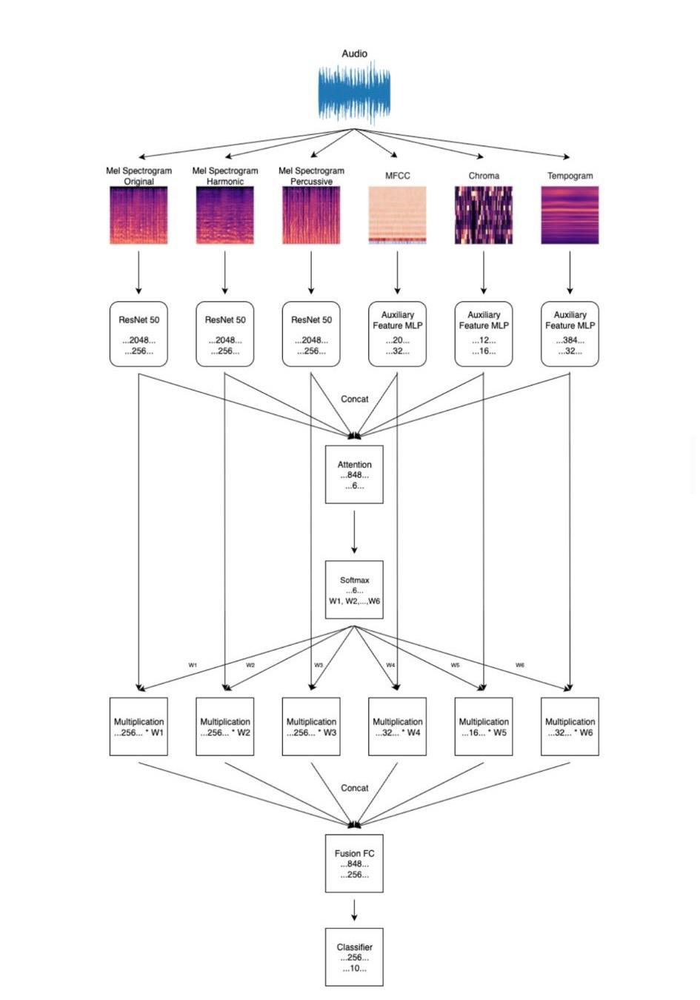

# DeepFusion — Music Genre Classification (Multi-modal)

DeepFusion is a PyTorch-based project for music genre classification using multi-modal audio features (mel-spectrograms, MFCC, chroma, and tempogram).

Key features
- Multi-modal model combining CNN branches for mel-spectrograms and MLPs for auxiliary features.
- Command-line interface (CLI) for training configuration (feature file, epochs, batch size, learning rate, etc.).
- Saves the best model checkpoint and logs training metrics to CSV and PNG files.

Repository structure
- `Propes_model` — Lightweight backwards-compatible runner (calls the package entrypoint).
- `train.py` — Top-level runner that sets up imports and executes the package CLI.
- `src/propes_model/` — Main package modules:
	- `data.py` — feature loading, preprocessing, Dataset and DataLoader creation.
	- `models.py` — model definitions (`MelCNN`, `AuxiliaryFeatureMLP`, `MultiModalNet`).
	- `train.py` — CLI entrypoint and training/evaluation loops.
	- `utils.py` — helper functions (CSV logging, directory utilities).

Quick start

1. Create a virtual environment and install requirements:

```bash
python3 -m venv venv
source venv/bin/activate
pip install -r requirements.txt
```

2. Prepare or point to your pre-extracted features pickle file. The project expects a list of items where each item is a dict containing keys such as `features` (with `mel_spec_orig`, `mel_spec_harm`, `mel_spec_perc`, `mfcc`, `chroma`, `tempogram`) and `label`.

3. Run training (recommended):

```bash
python train.py --features /path/to/features.pkl --epochs 100 --batch-size 64 --lr 1e-4 --model-dir ./models
```

Compatibility wrapper (optional):

```bash
python Propes_model --features /path/to/features.pkl --epochs 100
```

Output
- The best model checkpoint is written to the directory specified by `--model-dir` as `best_multi_modal_gtzan_model.pth`.
- Training metrics are appended to `training_results_single_split.csv` and a plot is saved as `training_history.png` (or `training_history_single_split.png` depending on runner).

Notes and tips
- `src/propes_model/models.py` uses `torchvision.models.resnet50(pretrained=True)` by default. If you are offline or prefer not to download pretrained weights, change `pretrained=True` to `pretrained=False`.
- The DataLoader `num_workers` is set to `0` by default for portability. Increase it (e.g., `num_workers=4`) for faster data loading on multi-core machines.
- Large model weight files are ignored via `.gitignore`. For versioning large files consider using Git LFS.

Contributing
- Contributions are welcome. Please open issues or submit pull requests. If you add new dependencies, update `requirements.txt` accordingly.

License
- Add a `LICENSE` file in the repository root to specify the project license.

Contact
- For questions or collaboration, create an issue or contact the repository owner.
Contact
- For questions or collaboration, create an issue or contact the repository owner.

If you'd like, I can also add a `LICENSE` (e.g. MIT) and a lightweight GitHub Actions workflow for basic checks (syntax and linting).

## Architecture



The project uses a multi-branch architecture: three ResNet-50 branches process different mel-spectrogram views (original, harmonic, and percussive), while lightweight MLP branches process auxiliary features (MFCC, chroma, and tempogram). The outputs are concatenated and passed through a small attention module that computes a weight for each modality. Each modality's feature vector is scaled by its attention weight and then concatenated again for final fusion through fully-connected layers and classification.

Why this design?
- Multi-view spectrograms: treating original, harmonic and percussive mel-spectrograms separately lets the model learn complementary representations specialized for tonal vs percussive content.
- Pretrained CNN backbones (ResNet-50): provide strong image-based feature extractors for spectrogram inputs and speed up convergence via transfer learning.
- Auxiliary MLPs for low-dimensional features: MFCC, chroma and tempogram carry compact but informative descriptors; smaller MLPs are sufficient and efficient for them.
- Attention-based fusion: instead of naively averaging or concatenating modalities, attention learns to weight modalities dynamically per clip — this helps the model focus on the most informative modalities for each example and improves robustness when some modalities are noisy or less discriminative.

You can replace the placeholder image at `docs/architecture.png` with the provided architecture PNG. On GitHub the image will render in the README automatically.

**To add the actual image file locally and commit:**

```bash
# copy the real PNG into the repo docs/ folder
cp /path/to/your/architecture.png docs/architecture.png
git add docs/architecture.png
git commit -m "docs: add architecture diagram"
git push origin main
```

